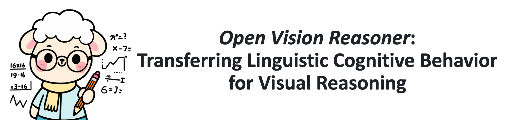
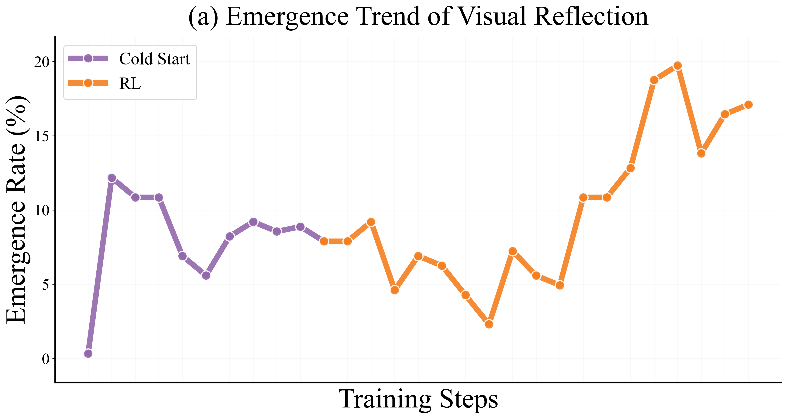
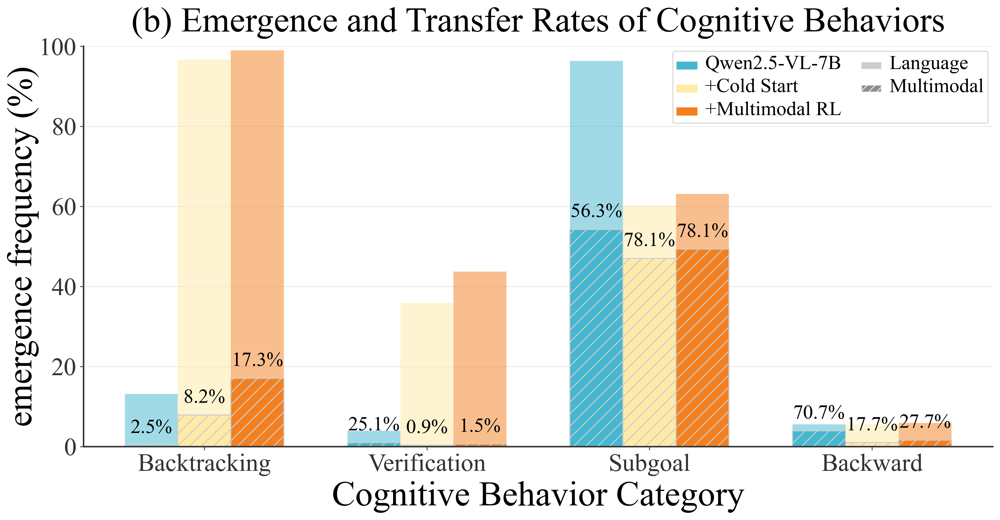
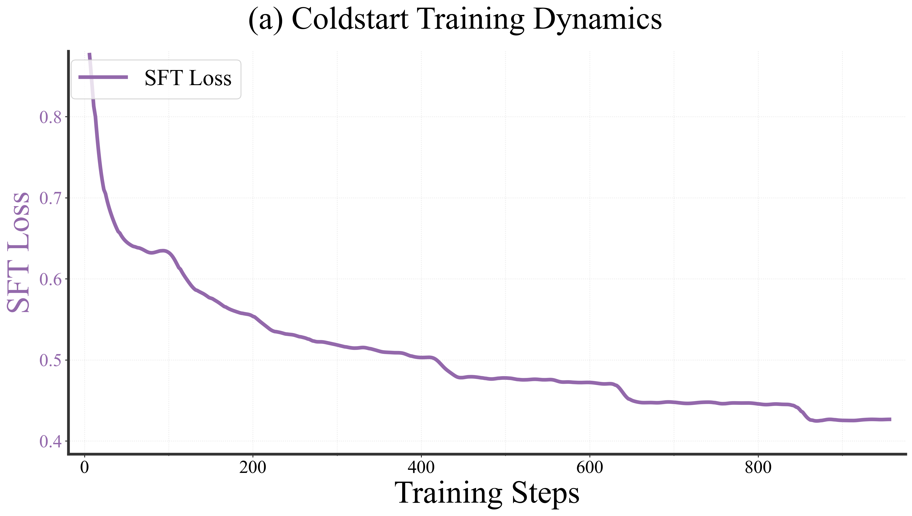

<div align="center" style="font-family: charter;">



<br />

<div align="center">
<a href="https://weiyana.github.io/Open-Vision-Reasoner/" target="_blank" style="margin-right: 10px;">
    
</a>
<a href="https://github.com/linkangheng/Open-Vision-Reasoner/tree/main/paper/Open-Vision-Reasoner.pdf" target="blank" style="margin-right: 10px;">
    
</a><a href="https://huggingface.co/collections/Kangheng/ovr-686646849f9b43daccbe2fe0" target="blank" style="margin-right: 10px;">
    
</a><a href="" target="blank" style="margin-right: 10px;">
    
</a>
</div>
</div>

## 📖 Overview


The remarkable reasoning capbility of Large Language Models (LLMs) stems from cognitive behaviors that emerge when reinforcing against verifiable rewards. This work investigates how to transfer this principle to Multimodal LLMs (MLLMs) to unlock **advanced visual reasoning**.

We introduce a two-stage paradigm built on Qwen2.5-VL-7B: a massive **text-only cold-start fine-tuning**, followed by **multimodal reinforcement learning** (RL) spanning nearly 1,000 steps—surpassing all prior open-source efforts in scale. This pioneering work reveals three fundamental insights: 

1. Behavior transfer emerges surprisingly early in cold start due to linguistic mental imagery. 
2. Cold start broadly memorizes visual behaviors, while RL critically discerns and scales up effective patterns. 
3. Transfer strategically favors high-utility behaviors such as visual reflection. 

Our resulting model, Open-Vision-Reasoner (OVR), achieves state-of-the-art performance on a suite of reasoning benchmarks, including **95.3%** on MATH500, **51.8%** on MathVision and **54.6%** on MathVerse. We release our model, data, and training dynamics to catalyze the development of more capable, behavior-aligned multimodal reasoners.

## 🚀 Model Release

> Models are available at Huggingface Collections: [Open-Vision-Reasoner](https://huggingface.co/collections/Kangheng/ovr-686646849f9b43daccbe2fe0). We release the cold-start model and the final RL-tuned OVR model to facilitate further research.

| **Model** | **Description** | **Download** |
|:---------:|:---------------:|:------------:|
| OVR-7B-ColdStart | Intermediate model after massive language-only cold-start fine-tuning | [🤗 OVR-7B-ColdStart](https://huggingface.co/Kangheng/OVR-7B-ColdStart) |
| OVR-7B-RL | Final model after large-scale multimodal RL training | [🤗 OVR-7B-RL](https://huggingface.co/Kangheng/OVR-7B-RL) |

## 📊 Performance Results

### **Language Reasoning**

Our model demonstrates exceptional language reasoning capabilities. On the challenging AIME 2024 and 2025 benchmarks, it dramatically surpasses other 7B open-source models by an average of over 10%, achieving performance comparable to leading 32B models. This superiority extends to general reasoning tasks, with significant gains of +4.6% on MMLU and +10.4% on MMLU-Pro over parameter-matched competitors. These results highlight the effectiveness of our curated, high-quality cold-start training data.
<p align="center">
  
</p>

### **Visual Reasoning**

OVR represents a significant breakthrough for 7B-scale models in visual reasoning.
It is the first post-trained Qwen2.5-VL-7B model to surpass the 50% threshold on MathVision, while also achieving state-of-the-art performance among 7B models on DynaMath and MathVerse.
This strong overall performance is further underscored by a substantial gain on MMMU-Pro (+7.2%) over previous methods.
These results demonstrate that reasoning capabilities acquired through language training can effectively transfer to multimodal tasks, resulting in notable improvements in visual reasoning performance.

<p align="center">
  
</p>

### **Cognitive Behavior Analysis**

Our analysis centers on the four pivotal visual cognitive behaviors. We systematically investigate how these patterns are transferred to visual modality from their linguistic counterparts. 

<p align="center">
  
  
</p>


## 🔧 Training Pipeline 

To facilitate efficient cognitive development and cross-modal generalization, we employ the popular "RL with a cold start" paradigm with two sequential training stages:

**Stage 1: Linguistic Cold Start**  
The LLM module is supervised fine-tuned on language-only reasoning datasets distilled from DeepSeek-R1, establishing core cognitive behaviors such as backtracking and subgoal decomposition within a purely linguistic setting.

**Stage 2: Multimodal RL**
We apply reinforcement learning with Open-Reasoner-Zero setting on both text and multimodal tasks using verifiable match rewards. This promotes reasoning generalization and aligns previously learned cognitive patterns with visual contexts, enabling effective cross-modal transfer.

## 📊 Training Dynamics and Performance Evolution

<p align="center">
  
  
</p>

<p align="center">
  
</p>

## 📋 Roadmap

- [x] `2025-07-04` 🎄: Initial release of OVR models, and research paper.
- [x] `2025-09-06` 📊: Release OVR cold-start data.
- [ ] 🚀: Continuously iterate on models and data to release more powerful versions of OVR. Stay tuned!

## 📚 Citation

If you find our work useful for your research, please consider citing our paper:
```bibtex
@misc{wei2025openvisionreasonertransferring,
      title={Open Vision Reasoner: Transferring Linguistic Cognitive Behavior for Visual Reasoning}, 
      author={Yana Wei and Liang Zhao and Jianjian Sun and Kangheng Lin and Jisheng Yin and Jingcheng Hu and Yinmin Zhang and En Yu and Haoran Lv and Zejia Weng and Jia Wang and Chunrui Han and Yuang Peng and Qi Han and Zheng Ge and Xiangyu Zhang and Daxin Jiang and Vishal M. Patel},
      year={2025},
      eprint={2507.05255},
      archivePrefix={arXiv},
      primaryClass={cs.CV},
      url={https://arxiv.org/abs/2507.05255}, 
}

```

