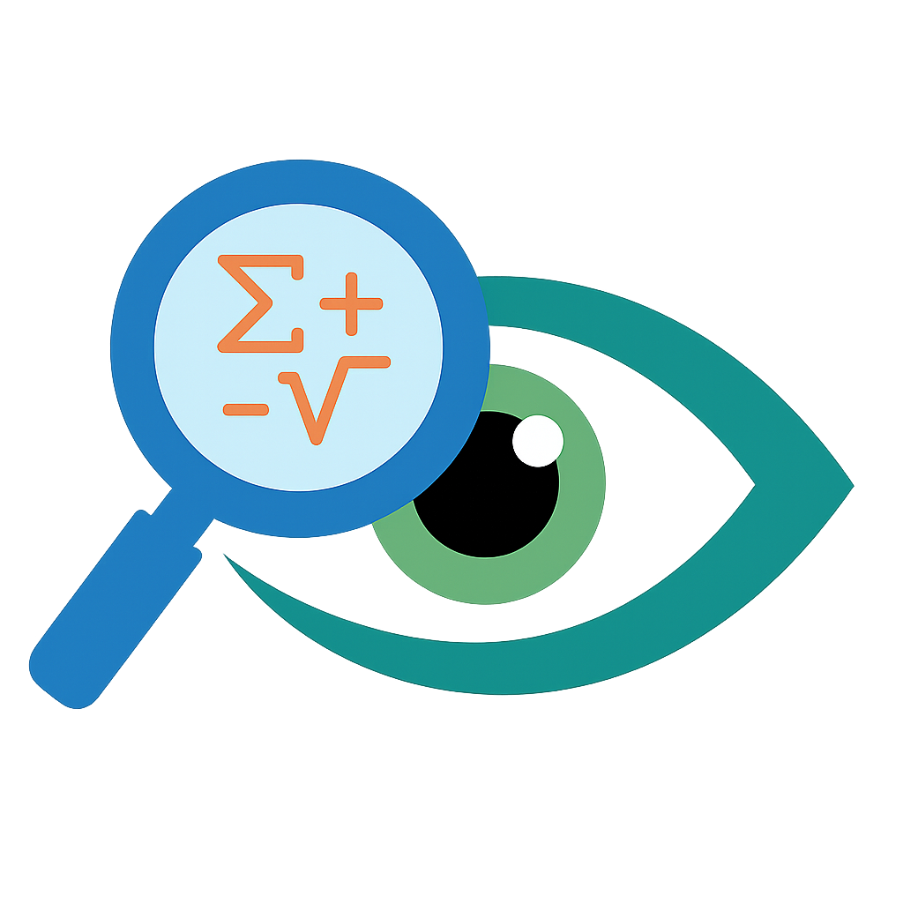
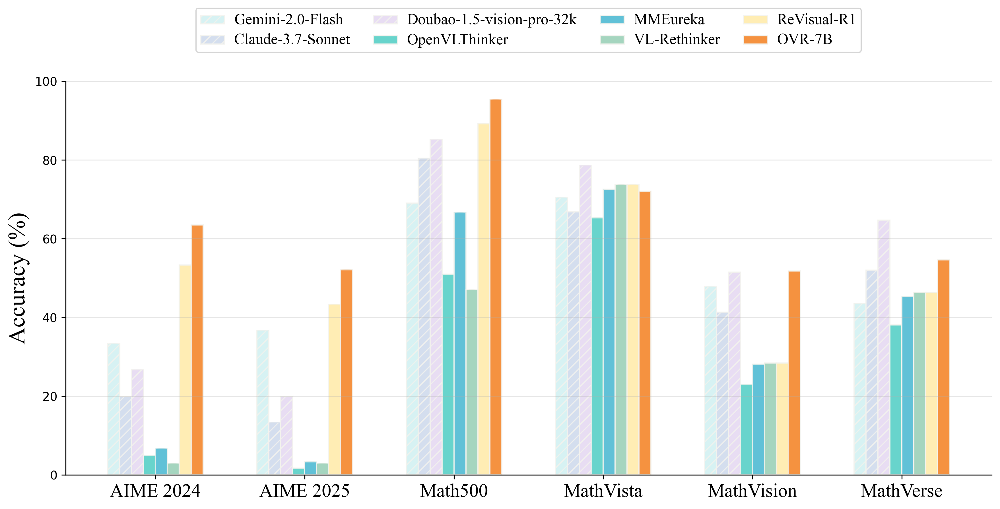
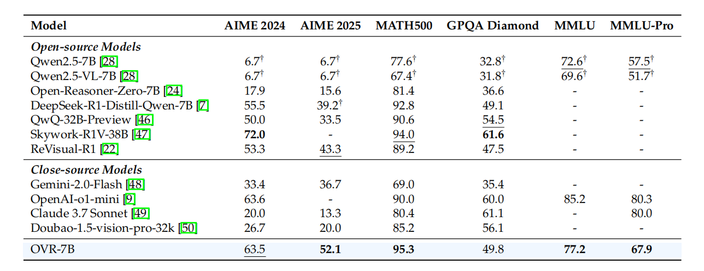
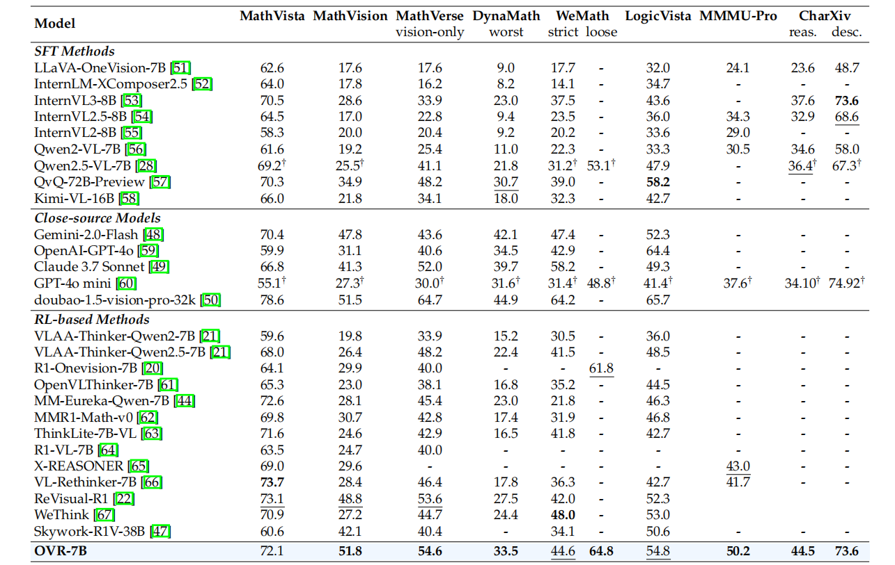
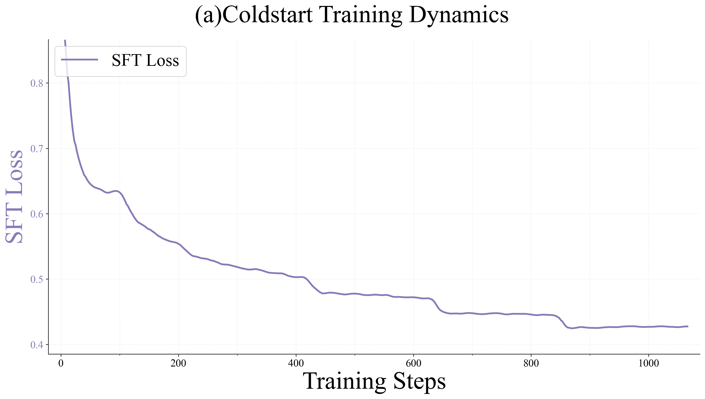
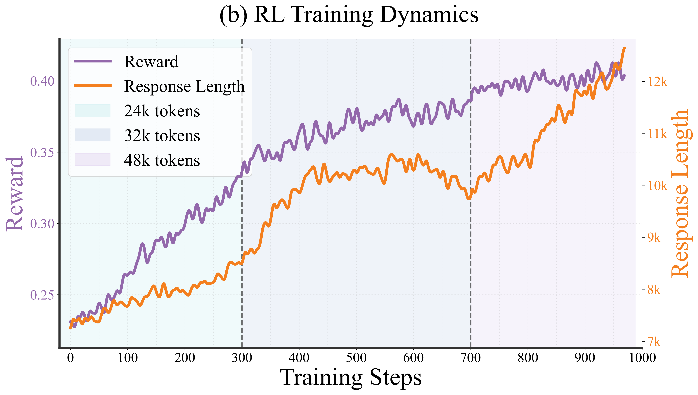
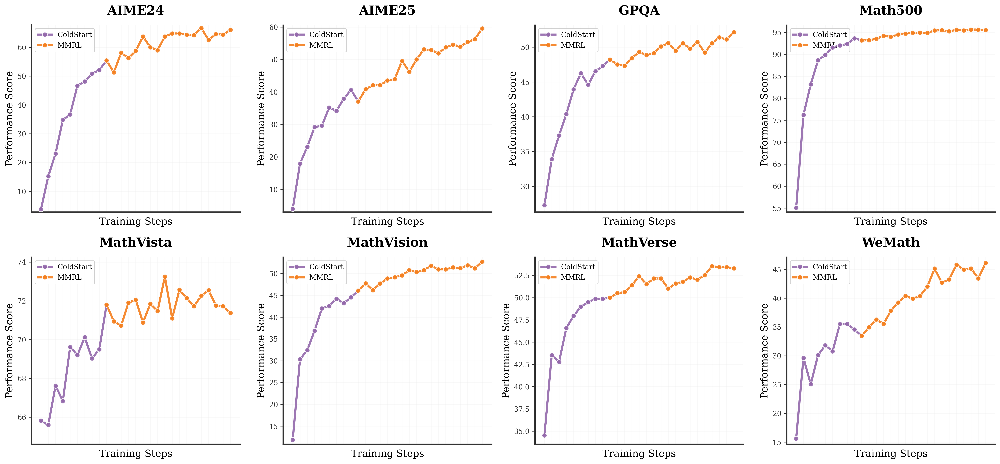

<h1> <i>Open Vision Reasoner</i>: Transferring Linguistic Cognitive Behavior for Visual Reasoning</h1>

 

## 📖 Overview

We present **Open Vision Reasoner (OVR)**, a novel approach that systematically transfers linguistic cognitive behaviors to visual reasoning in multimodal settings. Our fundamental insight is both striking and elegant: a vision-language model trained with massive language-only cold-start fine-tuning not only demonstrates superior performance on visual reasoning tasks, but also exhibits emergent visual cognitive behaviors such as re-inspection, cross-modal verification, and goal-driven visual tracing.

OVR employs a carefully designed two-stage training paradigm:
1. **Massive text-only cold-start fine-tuning** on over 2 million language-only reasoning examples with high learning rate and extensive iterations
2. **Large-scale multimodal reinforcement learning** using PPO with GAE, reaching nearly 1,000 update steps on over 300,000 mixed-modality examples

This represents the first large-scale RL scaling effort on a 7B multimodal model, demonstrating that cognitive behaviors learned from language naturally transfer to and enhance visual reasoning capabilities.

## 🔍 Key Discoveries

### **Linguistic Cognitive Behaviors Transfer Naturally to Visual Modality**
- Visual reasoning abilities emerge from language-only cold-start training without explicit visual supervision
- Cross-modal cognitive behaviors include visual re-inspection, visual decomposition, perceptual cross-checking, and goal-driven visual tracing
- Behavior occurrence increases dramatically after our two-stage training pipeline, with average cognitive behavior rate rising from 1.5% to 36.0%

### **Reinforcement Learning Amplifies Cognitive Behavior Transfer**
- Language-acquired cognitive behaviors are significantly enhanced through multimodal RL
- Simple rule-based rewards (binary correctness) are sufficient to strengthen visual cognitive patterns
- Strong positive correlation exists between cognitive behaviors and reasoning correctness across all behavior types

### **Emergent Visual-Specific Cognitive Behaviors**
- Four distinct visual cognitive behaviors emerge naturally: re-inspection (2.5%), decomposition (22.0%), cross-checking (0.2%), and tracing (8.4%)
- These behaviors represent genuine visual reasoning patterns beyond linguistic cognitive behaviors
- Behavior transfer rate from language to vision reaches 54.2% after multimodal RL training

## 🚀 Model Release

> Models are available at [Huggingface Collections: Open-Vision-Reasoner](https://huggingface.co/collections/ovr-models)

| **Model** | **Description** | **Download** |
|:---------:|:---------------:|:------------:|
| OVR-7B-ColdStart | Intermediate model after massive language-only cold-start fine-tuning | [🤗 OVR-7B-ColdStart](https://huggingface.co/ovr/OVR-7B-ColdStart) |
| OVR-7B-RL | Final model after large-scale multimodal RL training | [🤗 OVR-7B-RL](https://huggingface.co/ovr/OVR-7B-RL) |

## 📊 Performance Results

### **State-of-the-Art Language Reasoning Performance**

OVR achieves remarkable performance on mathematical reasoning benchmarks, surpassing existing open-source 7B models and approaching the performance of much larger closed-source systems.

  

### **Superior Visual Reasoning Capabilities**

Our model demonstrates exceptional cross-modal transfer, significantly outperforming existing methods on diverse visual reasoning benchmarks.

  

### **Systematic Cognitive Behavior Analysis**

We conduct comprehensive analysis of cognitive behavior emergence and transfer throughout the training pipeline.

  

  

| Training Stage | Backtracking | Verification | Subgoal Setting | Backward Chaining | Avg CBR | BTR |
|----------------|--------------|--------------|-----------------|-------------------|---------|-----|
| Base Model | 39.7% → 4.0% | 29.6% → 2.0% | 30.0% → 0.0% | 0.8% → 0.0% | 25.0% → 1.5% | 0.060 |
| +Cold Start | 93.7% → 57.1% | 84.0% → 16.0% | 74.0% → 22.0% | 2.0% → 16.0% | 63.4% → 27.8% | 0.438 |
| +Multimodal RL | 98.0% → 75.0% | 86.8% → 22.0% | 77.5% → 24.0% | 3.1% → 23.0% | 66.4% → 36.0% | 0.542 |

> [!IMPORTANT]
> Visual cognitive behaviors emerge naturally from language-trained reasoning patterns and are significantly amplified through large-scale multimodal RL training.

## 🔧 Training Framework

Our training framework consists of three sequential stages built upon Qwen2.5-VL-7B:

**Stage 0: Foundation Model**
- Qwen2.5-VL-7B as the base multimodal foundation model

**Stage 1: Massive Language Cold-Start**  
- Supervised fine-tuning on over 2 million language-only reasoning examples
- Distilled responses from DeepSeek-R1 for high-quality cognitive pattern learning
- Establishes foundational linguistic cognitive behaviors through extensive iterations

**Stage 2: Large-Scale Multimodal RL**
- PPO-based reinforcement learning on 300,000+ mixed-modality examples
- Vanilla PPO with GAE (γ=1, λ=1) for stable long-term reasoning
- Binary rule-based rewards focusing solely on correctness
- Nearly 1,000 update steps representing the largest open-source RL effort on 7B multimodal models

**Training Dynamics and Performance Evolution**

  
  

  

## 📋 Roadmap

- [x] `2025-06-27` 🎄: Initial release of OVR models, training data, and research paper.
- [ ] 🔧: Release comprehensive training code and framework.
- [ ] 📚: Release detailed training documentation and tutorials.
- [ ] 🎯: Release evaluation scripts and benchmark implementations.
- [ ] 🔍: Release cognitive behavior analysis toolkit.

## 🙏 Acknowledgments

## 📚 Citation

If you find our work useful for your research, please consider citing our paper:
