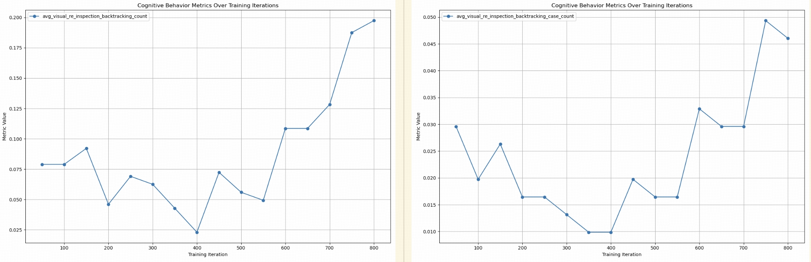

 

## 📖 Overview

At the heart of **Open Vision Reasoner (OVR)** lies a simple yet powerful discovery: the sophisticated reasoning abilities of language models can be directly transferred to unlock advanced visual reasoning.

We find that a Multimodal Large Language Model (MLLM), when first subjected to a massive "cold-start" fine-tuning phase using only text-based reasoning data, surprisingly develops cognitive patterns that seamlessly generalize to the visual domain. Subsequent reinforcement learning then activates and refines these behaviors, leading to state-of-the-art performance.

Our two-stage paradigm involves:

1. A **linguistic cold-start**, fine-tuning the model on over 2 million language-only reasoning examples to instill foundational cognitive behaviors.

2. Followed by **large-scale multimodal reinforcement learning (RL)**, which activates and adapts these behaviors for visual tasks using over 300,000 mixed-modality examples.

This work culminates in the largest open-source RL effort on a 7B-scale MLLM, validating our core hypothesis: **linguistic cognition is a powerful scaffold for visual intelligence**.

## 🔍 Key Discoveries

### Linguistic Cognition Transfers to Vision

A language-only cold-start is sufficient to elicit robust cognitive patterns that transfer to vision without direct multimodal training. This allows the model to develop a foundational reasoning capability that is modality-agnostic.

### RL Amplifies and Activates Behaviors

Subsequent multimodal RL acts as a catalyst, significantly amplifying these nascent cognitive abilities. We show that a simple, rule-based reward signal (binary correctness) is enough to strengthen these patterns and correlate their presence with higher reasoning accuracy.

### Emergence of Genuine Visual Reasoning

OVR develops a repertoire of genuine visual cognitive behaviors, including re-inspection (2.5%), decomposition (22.0%), cross-checking (0.2%), and goal-driven tracing (8.4%). This results in a Behavior Transfer Rate (BTR) of 54.2% from language to vision, demonstrating highly efficient cross-modal generalization.

## 🚀 Model Release

> Models are available at [Huggingface Collections: Open-Vision-Reasoner](https://huggingface.co/collections/ovr-models). We release the intermediate cold-start model and the final RL-tuned OVR model to facilitate further research.

| **Model** | **Description** | **Download** |
|:---------:|:---------------:|:------------:|
| OVR-7B-ColdStart | Intermediate model after massive language-only cold-start fine-tuning | [🤗 OVR-7B-ColdStart](https://huggingface.co/ovr/OVR-7B-ColdStart) |
| OVR-7B-RL | Final model after large-scale multimodal RL training | [🤗 OVR-7B-RL](https://huggingface.co/ovr/OVR-7B-RL) |

## 📊 Performance Results

### **Language Reasoning**

The initial cold-start phase equips OVR with formidable language reasoning capabilities, outperforming all open-source 7B models on key math and logic benchmarks.

  

### **Visual Reasoning**

Crucially, these linguistic skills translate into state-of-the-art performance on visual reasoning tasks, validating the effectiveness of our cognitive transfer approach.

  

### **Cognitive Behavior Analysis**

Our analysis systematically tracks the emergence of cognitive behaviors, confirming that they are learned during the cold-start and amplified by RL.

  

> [!IMPORTANT]
> Linguistic cognitive patterns, once established, can be powerfully transferred and amplified for visual reasoning through targeted reinforcement learning.

## 🔧 Training Framework

Our methodology builds upon the robust Qwen2.5-VL-7B foundation model, applying a sequential two-stage training process:

**Stage 1: Linguistic Cold-Start**  
- Supervised fine-tuning on over 2 million language-only reasoning examples
- Distilled responses from DeepSeek-R1 for high-quality cognitive pattern learning
- Establishes foundational linguistic cognitive behaviors through extensive iterations

**Stage 2: Multimodal Reinforcement Learning**
- PPO-based reinforcement learning on 300,000+ mixed-modality examples
- Vanilla PPO with GAE (γ=1, λ=1) for stable long-term reasoning
- Binary rule-based rewards focusing solely on correctness
- Nearly 1,000 update steps representing the largest open-source RL effort on 7B multimodal models

## 📊 Training Dynamics and Performance Evolution

  
  

  

## 📋 Roadmap

- [x] `2025-06-30` 🎄: Initial release of OVR models, training data, and research paper.
- [ ] 🔧: Release training code.
- [ ] 🚀: Continuously iterate on models and data to release more powerful versions of OVR. Stay tuned!

## 🙏 Acknowledgments

## 📚 Citation

If you find our work useful for your research, please consider citing our paper:
